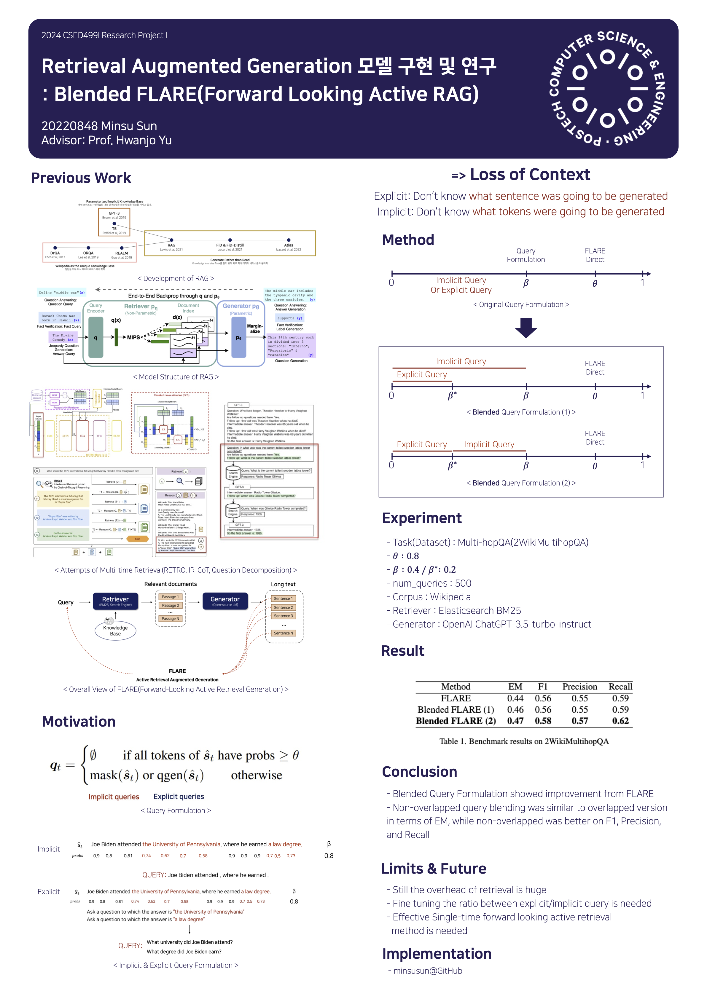

# BLARE(Blended FLARE, Forward-Looking Active REtreival)

*Forked from original [FLARE Repository](https://github.com/jzbjyb/FLARE)*

Proposed as the topic of Research Project I(CSED499I), which is one of the two research projects for the graduation.

Basic quickstart is as same as the original repo's([link](https://github.com/minsusun/BLARE/blob/main/README.md))

For further information or any issues, please leave an issue on this repository

